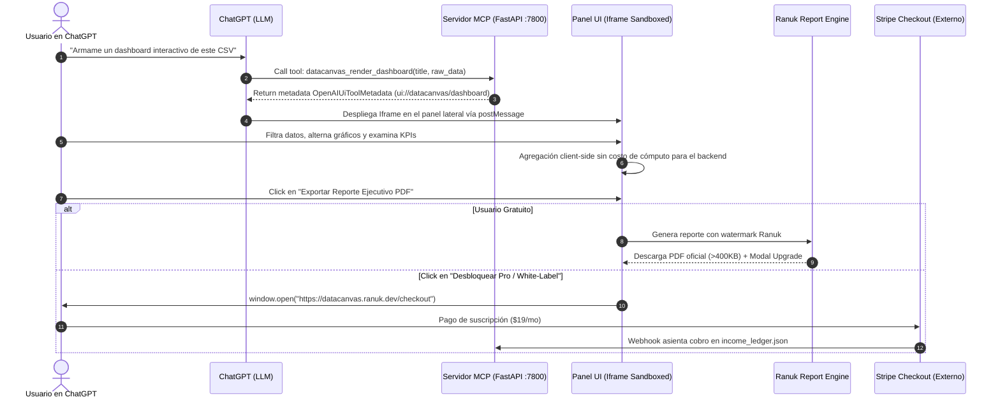

# DataCanvas — ChatGPT Plugin Extension (MCP)

<p align="center">
  
  
  
  
  
</p>

> **Desarrollado y operado por Ranuk IT Solutions (Emilio Ranucoli)**  
> Transforma cualquier conjunto de datos (CSV, TSV, JSON, Excel) en un tablero analítico interactivo en tiempo real directamente en la interfaz de ChatGPT (`thread_panel` lateral y `global` sidebar), con exportación ejecutiva de PDFs vectoriales de alta fidelidad (>400KB) y funnel externo a monetización SaaS.

---

## 🎯 Resumen Ejecutivo

DataCanvas resuelve la principal limitación del análisis de datos en ChatGPT: **la estaticidad**. Cuando un usuario proporciona datos tabulares, en lugar de recibir una tabla de texto plano o una imagen estática generada con Matplotlib, DataCanvas despliega un **Conversation Panel interactivo** con filtros en vivo, selector dinámico de tipos de gráficos y tarjetas KPI reactivas.

### Por qué este modelo genera negocio:
- **Costo de Adquisición (CAC) = $0:** Tráfico orgánico impulsado por el directorio global de OpenAI (~1.2B WAU) y triggers contextuales de conversación.
- **Costo de Cómputo Cliente = $0:** Las agregaciones analíticas corren en el navegador del usuario vía DuckDB-WASM y Apache ECharts.
- **Monetización 100% Externa:** Cumple de forma estricta las normativas de OpenAI. Cero cobros digitales dentro del plugin; todo upgrade a planes Pro ($19/mes o $190/año) se realiza vía Stripe Hosted Checkout en un dominio controlado por Ranuk IT Solutions, sin comisiones ni revenue-share.

---

## 🏗️ Arquitectura del Sistema



---

## 📦 Estructura del Repositorio

```text
rk-mcp-datacanvas/
├── manifest.json              # Especificación oficial de OpenAI Plugin Extension
├── README.md                  # Manual de arquitectura, despliegue y operaciones
├── server/
│   ├── main.py               # Servidor FastAPI (Protocolo MCP JSON-RPC + UI Server)
│   ├── tools.py              # Definición analítica y schemas OpenAIUiToolMetadata
│   └── report_bridge.py      # Conexión al motor ranukita_report.py
├── ui/
│   └── index.html            # Frontend interactivo para el iframe (Tailwind + ECharts)
├── scripts/
│   ├── rk-mcp-pack.py        # Validador y empaquetador para Apps Management (.zip)
│   └── rk-mcp-growth.py      # Cron diario de health check, leads B2B y sync con ledger
├── tests/
│   └── test_mcp_server.py    # Suite de tests (MCP handshake, tools y reportes)
├── submission/
│   ├── video_script.md       # Guion de 75 segundos para el revisor de OpenAI
│   └── test_cases.json       # Casos de prueba reproducibles para el submission
└── dist/
    └── rk-mcp-datacanvas.zip # Paquete validado y listo para envío
```

---

## 💎 Modelo de Oferta: Free vs. Pro

| Característica | DataCanvas Free (In-Plugin) | DataCanvas Pro ($19/mes o $190/año) |
|---|:---:|:---:|
| Visualización interactiva en ChatGPT | Ilimitada | Ilimitada |
| Gráficos dinámicos (Barras, Líneas, Donut) | Sí | Sí + Mapas de Calor y Funnels |
| Filtros en tiempo real vía DuckDB-WASM | Sí | Sí |
| Exportación de Reportes PDF | 3 reportes/mes (con marca de agua) | **Ilimitados, White-Label y >400KB** |
| Persistencia de plantillas en Sidebar | 1 plantilla | **Ilimitadas** |
| Conexión con PostgreSQL / BigQuery | No | **Sí** |
| Licencia On-Premise para empresas | No | **Disponible ($490 un solo pago)** |

---

## 🤖 Manual de Operaciones: Distribución de Tareas

Para garantizar que el sistema funcione de forma autónoma y minimice la carga manual, los roles están distribuidos entre el equipo de agentes de Ranukita y Emilio:

### 👤 Tareas de Emilio (Única vez — ~5 minutos):
1. **Subir paquete en OpenAI:** Ingresar a [OpenAI Developer Dashboard / Apps Management](https://developers.openai.com/apps), crear nueva aplicación y subir el archivo [`dist/rk-mcp-datacanvas.zip`](file:///Users/emilioranucoli/Desktop/Oficina_Ranuk/rk-mcp-datacanvas/dist/rk-mcp-datacanvas.zip).
2. **Video de Submission:** Grabar un walkthrough de 75 segundos siguiendo el guion [`submission/video_script.md`](file:///Users/emilioranucoli/Desktop/Oficina_Ranuk/rk-mcp-datacanvas/submission/video_script.md).
3. **Dominio Público:** Asignar el túnel DNS `datacanvas.ranuk.dev` hacia el servidor local (ej. Cloudflare Tunnel hacia el puerto 7800).

### 🤖 Tareas de los Agentes de Ranukita (Automáticas 24/7):
- **Director Comercial:** Revisa semanalmente la tasa de conversión a checkout y valida las metas de ingresos en el ledger.
- **Vendedor:** Monitorea los correos empresariales registrados en descargas de reportes para enviar propuestas de licencia Enterprise ($490 a $1,500).
- **Dev-Bounties / NEXUS:** Mantiene el servidor MCP activo, atiende issues de formato de datos y corre los tests de regresión.
- **Cron Diario (`rk-mcp-growth.py`):**
  - Corre a las 10:00 AM todos los días.
  - Verifica el uptime del servidor.
  - Registra las transacciones externas de Stripe directamente en `~/.ranukita/income_ledger.json`.
  - Emite el reporte de crecimiento en `~/.ranukita/buzon/`.

---

## 🚀 Guía de Inicio Rápido

### 1. Ejecutar Tests de Verificación
```bash
python3 -m unittest tests/test_mcp_server.py
```

### 2. Iniciar Servidor MCP Localmente
```bash
python3 server/main.py
# El servidor iniciará en http://127.0.0.1:7800
```

### 3. Exponer con Túnel Cloudflare (para pruebas con OpenAI)
```bash
cloudflared tunnel --url http://127.0.0.1:7800
```

### 4. Regenerar el Paquete de Envío
```bash
python3 scripts/rk-mcp-pack.py
```

### 5. Ejecutar Cron de Crecimiento Manualmente
```bash
python3 scripts/rk-mcp-growth.py
```
